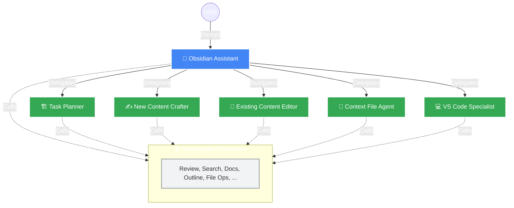

<div align="center">

# 💎 Obsidian Assistant

**Supercharge your Second Brain with Google's ADK**

An intelligent multi-agent system for your Obsidian vault, powered by Google's Agent Development Kit.

[](https://www.python.org/downloads/release/python-3120/)
[](https://github.com/pau-fortiana/obsidian-assistant-adk/blob/main/LICENSE)
[](https://google.github.io/adk-docs/)
[](https://obsidian.md)

[Report Bug](https://github.com/pau-fortiana/obsidian-assistant-adk/issues) · [Request Feature](https://github.com/pau-fortiana/obsidian-assistant-adk/issues)

</div>

---

## 🧠 About The Project

**Obsidian Assistant** is an intelligent multi-agent system designed to streamline your knowledge management within Obsidian. 

Built with **Google's Agent Development Kit (ADK)**, this hierarchical multi-agent architecture transforms your vault from a static collection of notes into a dynamic knowledge base. It goes beyond simple editing by acting as a complex task planner and software project assistant.

> *"Whether you're a student, a writer, or a lifelong learner, the Obsidian Assistant is here to help you connect ideas, uncover insights, and unlock the full potential of your second brain."*

### 🏗️ Architecture



---

## ✨ Key Features

| Feature | Description |
| :--- | :--- |
| **📝 Seamless Note Management** | Create, edit, and organize your Markdown notes with simple natural language commands. |
| **⚡ Content Enhancement** | Automatically improve your notes with summaries, structural suggestions, and linting. |
| **🏗️ Project Planning** | Design implementation plans and break down complex tasks into structured lists. |
| **🧠 Obsidian Expertise** | Get guidance on Obsidian's specific features and workflows without leaving your vault. |
| **💻 Developer-Friendly** | Create Markdown-based context files (`AGENTS.md`) and custom VS Code Copilot Agent Modes. |
| **🔌 Modular & Extensible** | Built with a modular ADK architecture that is easy to maintain and extend. |

---

## 🚀 Getting Started

Follow these steps to get your assistant up and running.

### Prerequisites

* **Python 3.12+**
* **[uv](https://github.com/astral-sh/uv)** (An extremely fast Python package manager)

### 📦 Installation

1.  **Clone the repository**
    ```sh
    git clone [https://github.com/pau-fortiana/obsidian-assistant-adk.git](https://github.com/pau-fortiana/obsidian-assistant-adk.git)
    cd obsidian-assistant-adk
    ```

2.  **Install `uv`**
    ```sh
    pip install uv
    ```

3.  **Setup Environment & Dependencies**
    ```sh
    # Create and activate virtual environment
    uv venv
    source .venv/bin/activate

    # Sync dependencies
    uv sync
    ```

4.  **Configuration**
    Create a `.env` file in the project root:
    ```env
    GOOGLE_API_KEY="your-gemini-api-key"
    OBSIDIAN_VAULT_PATH="/path/to/your/actual/obsidian/vault"
    ```
    > ⚠️ *Note: If `OBSIDIAN_VAULT_PATH` is not set, the assistant defaults to creating a new vault in `outputs/obsidian_vault`.*

---

## 🎮 Usage

You can interact with the Obsidian Assistant in two ways:

### 1️⃣ Web Interface (Recommended)
For a user-friendly, browser-based experience.

```bash
adk web
```

### 2️⃣ Command-Line Interface
For quick interactions directly from your terminal.

```bash
adk run obsidian_assistant
```

---

## ⚖️ License & Attribution

### License
Distributed under the Apache 2.0 License. See `LICENSE` for more information.

### Foundation Attribution
The core strategy and implementation logic for this ADK agent are directly derived from the following work, which is licensed under the **Creative Commons Attribution 4.0 International (CC BY 4.0) License**:

* **Original Source:** Obsidian Assistant ([Kaggle](https://www.kaggle.com/) Submission Writeup for [`Agents Intensive - Capstone Project`](https://www.kaggle.com/competitions/agents-intensive-capstone-project/overview)) Community Hackathon.
* **Author:** Pau Fortiana Chico (paufortiana)
* **Link:** [Obsidian Assistant Writeup](https://www.kaggle.com/competitions/agents-intensive-capstone-project/writeups/obsidian-assistant)
* **Source Code (Apache 2.0):** [Obsidian Assistant Notebook](https://www.kaggle.com/code/paufortiana/obsidian-assistant). A local copy is included in this repository at [`notebooks/obsidian_agent.ipynb`](notebooks/obsidian_agent.ipynb).

---

## 🙏 Acknowledgments

* Powered by [Google's Agent Development Kit](https://google.github.io/adk-docs/).
* Built for the [5-day AI Agents Intensive Course with Google](https://www.kaggle.com/learn-guide/5-day-agents).
